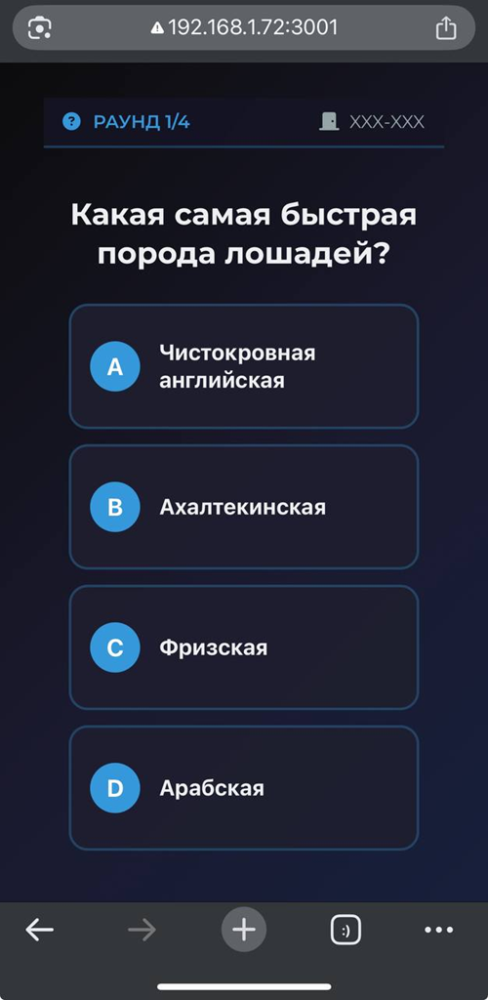

# Online Party Quiz - Free Multiplayer Game for Local Network

  

**The ultimate party game for gatherings!** Host creates a quiz on a laptop, players join via QR code from their phones - no internet required, just local Wi-Fi!

Perfect for parties, family gatherings, team buildings, or classroom activities.

## ✨ Features

- 🚀 **Zero setup** - Just install Node.js and run
- 📱 **Mobile-friendly** - Players join via QR code
- 🌐 **No internet needed** - Works on local network
- ⚡ **Real-time** - Live leaderboards and instant feedback
- 🎨 **Beautiful UI** - Modern design with animations
- 🔧 **Customizable** - Easy to add your own questions
- 📊 **Statistics** - See who knows the most

## 🏗️ Architecture

```
┌─────────────┐     ┌─────────────┐     ┌─────────────┐
│   Host      │     │   Server    │     │   Players   │
│  (Laptop)   │◄───►│ (Node.js)   │◄───►│  (Phones)   │
│  index.html │     │  Express    │     │  room.html  │
│             │     │  Socket.io  │     │  game.html  │
└─────────────┘     └─────────────┘     └─────────────┘
```

## 🚀 Quick Start

### **For Host (on Laptop/Computer)**

1. **Install Node.js** (version 16 or higher) from [nodejs.org](https://nodejs.org/)

2. **Clone and setup:**
```bash
git clone https://github.com/nslobodov/online-party-quiz.git
cd online-party-quiz
npm install
```

3. **Start the server:**
```bash
npm start
```

4. **Open in browser:** `http://localhost:3001`

5. **Create a game room** and show the QR code to players

### **For Players (on Mobile Phones)**

1. **Connect to the same Wi-Fi** as the host computer

2. **Scan the QR code** shown on host's screen

3. **Enter your name** and join the room

4. **Wait for game to start** - host controls the flow

5. **Answer questions** before time runs out!

## 📱 Game Flow

1. **Host creates room** → QR code generated
2. **Players scan QR** → Join room with names
3. **Host starts game** → Questions appear on all devices
4. **Each round:**
   - 🖼️ **Photo** (20s) - Get a hint from the image
   - ❓ **Question** (120s) - Multiple choice
   - 🏆 **Leaderboard** (10s) - See rankings
5. **Game ends** after 30 questions → Final results

## ⚙️ Customization

### Add Your Own Questions

Edit `questions.csv`:

```csv
id,question,options,correctIndex,category,image
1,"What was the name of Don Quixote's horse?","Rocinante;Bucephalus;Pegasus;Bolivar",0,"Literature","rosinante.jpg"
2,"Who painted 'Bathing of the Red Horse'?","Kuzma Petrov-Vodkin;Ilya Repin;Mikhail Vrubel;Wassily Kandinsky",0,"Art","red_horse.jpg"
```

### Change Game Settings

Edit `server.js`:
```javascript
const GAME_SETTINGS = {
  totalQuestions: 30,     // Total questions per game
  photoTime: 30,         // Seconds for photo round
  questionTime: 30,      // Seconds for question round
  leaderboardTime: 15,   // Seconds for leaderboard
  maxPlayers: 20         // Maximum players per room
}
```

## 🗂️ Project Structure

```
online-party-quiz/
├── public/                 # Frontend files
│   ├── index.html         # Host page
│   ├── room.html          # Player join page
│   ├── game.html          # Game screen
│   ├── js/                # JavaScript files
│   │   ├── game.js        # Game logic
│   │   ├── room.js        # Room logic
│   │   └── socket-manager.js
│   ├── css/               # Stylesheets
│   └── images/            # Question images
├── questions.csv          # Questions database
├── server.js             # Main server file
├── package.json          # Dependencies
└── README.md            # This file
```

## 🛠️ Development

### Running in Development Mode
```bash
npm run dev
```

### Adding Dependencies
```bash
npm install <package-name>
```

### Linting & Formatting
```bash
npm run lint    # Check code quality
npm run format  # Auto-format code
```

## 🤝 Contributing

We love contributions! Here's how to help:

1. **Fork** the repository
2. **Create a feature branch:** `git checkout -b feature/amazing-feature`
3. **Commit your changes:** `git commit -m 'Add amazing feature'`
4. **Push to the branch:** `git push origin feature/amazing-feature`
5. **Open a Pull Request**

### Ideas for Contributions:
- 📱 Improve mobile responsiveness
- 🎨 Add new themes/skins
- 🎵 Add sound effects
- 📊 Add more statistics
- 🌍 Translate to other languages

## 📄 License

This project is licensed under the MIT License - see the [LICENSE](LICENSE) file for details.

## 🙏 Acknowledgments

- **Socket.io** for real-time communication
- **Express.js** for the server framework
- **Font Awesome** for icons
- **All contributors** who help improve this project

## ❓ FAQ

### Q: Does it work without internet?
**A:** Yes! The game works on local network. No internet connection needed.

### Q: How many players can join?
**A:** Technically unlimited, but practically 20-30 for best performance.

### Q: Can I use my own questions?
**A:** Absolutely! Just edit the `questions.csv` file.

### Q: Is it free?
**A:** 100% free and open source!

### Q: Can I host it online?
**A:** Yes, you can deploy it to services like Heroku, Railway, or your own VPS.

## 📞 Support

Found a bug or have a feature request?
- Open an [Issue](https://github.com/nslobodov/online-party-quiz/issues)
- Star the repo if you like it! ⭐

---

**Made with ❤️ for fun parties and gatherings!**
\
\
\
\
\
\
\
\
\
\
\
\
\
\
\
\
\
\
\
\
# Online Party Quiz - Бесплатная мультиплеерная игра для локальной сети

  

**Идеальная игра для вечеринок!** Ведущий запускает квиз на ноутбуке, игроки присоединяются через QR-код с телефонов - интернет не нужен, только локальный Wi-Fi!

Идеально подходит для вечеринок, семейных посиделок, тимбилдингов или занятий в классе.

## ✨ Возможности

- 🚀 **Ноль настроек** - Просто установите Node.js и запустите
- 📱 **Адаптивный дизайн** - Игроки присоединяются через QR-код
- 🌐 **Без интернета** - Работает в локальной сети
- ⚡ **В реальном времени** - Живой лидерборд и мгновенная обратная связь
- 🎨 **Красивый интерфейс** - Современный дизайн с анимациями
- 🔧 **Настраиваемый** - Легко добавлять свои вопросы
- 📊 **Статистика** - Узнайте, кто знает больше всех

## 🏗️ Архитектура

```
┌─────────────┐     ┌─────────────┐     ┌─────────────┐
│  Ведущий    │     │   Сервер    │     │   Игроки    │
│  (Ноутбук)  │◄───►│ (Node.js)   │◄───►│  (Телефоны) │
│  index.html │     │  Express    │     │  room.html  │
│             │     │  Socket.io  │     │  game.html  │
└─────────────┘     └─────────────┘     └─────────────┘
```

## 🚀 Быстрый старт

### **Для ведущего (на ноутбуке/компьютере)**

1. **Установите Node.js** (версия 16 или выше) с [nodejs.org](https://nodejs.org/)

2. **Склонируйте и настройте:**
```bash
git clone https://github.com/nslobodov/online-party-quiz.git
cd online-party-quiz
npm install
```

3. **Запустите сервер:**
```bash
npm start
```

4. **Откройте в браузере:** `http://localhost:3001`

5. **Создайте игровую комнату** и покажите QR-код игрокам

### **Для игроков (на мобильных телефонах)**

1. **Подключитесь к тому же Wi-Fi**, что и компьютер ведущего

2. **Отсканируйте QR-код** на экране ведущего

3. **Введите ваше имя** и присоединитесь к комнате

4. **Дождитесь начала игры** - ведущий управляет процессом

5. **Отвечайте на вопросы** до истечения времени!

## 📱 Как проходит игра

1. **Ведущий создает комнату** → Генерируется QR-код
2. **Игроки сканируют QR** → Присоединяются с именами
3. **Ведущий начинает игру** → Вопросы появляются на всех устройствах
4. **Каждый раунд:**
   - 🖼️ **Фото-подсказка** (20с) - Угадайте по изображению
   - ❓ **Вопрос** (120с) - Выбор из вариантов
   - 🏆 **Лидерборд** (10с) - Следите за рейтингом
5. **Игра заканчивается** после 30 вопросов → Финальные результаты

## ⚙️ Настройка

### Добавьте свои вопросы

Отредактируйте `questions.csv`:

```csv
id,question,options,correctIndex,category,image
1,"Как звали коня Дон-Кихота?","Росинант;Буцефал;Пегас;Боливар",0,"Литература","rosinante.jpg"
2,"Кто автор картины 'Купание красного коня'?","Кузьма Петров-Водкин;Илья Репин;Михаил Врубель;Василий Кандинский",0,"Искусство","red_horse.jpg"
```

### Измените настройки игры

Отредактируйте `server.js`:
```javascript
const GAME_SETTINGS = {
  totalQuestions: 30,     // Всего вопросов в игре
  photoTime: 30,         // Секунд на фото раунд
  questionTime: 30,      // Секунд на вопрос
  leaderboardTime: 15,   // Секунд на лидерборд
  maxPlayers: 20         // Максимум игроков в комнате
}
```

## 🗂️ Структура проекта

```
online-party-quiz/
├── public/                 # Фронтенд файлы
│   ├── index.html         # Страница ведущего
│   ├── room.html          # Страница присоединения
│   ├── game.html          # Игровой экран
│   ├── js/                # JavaScript файлы
│   │   ├── game.js        # Логика игры
│   │   ├── room.js        # Логика комнаты
│   │   └── socket-manager.js
│   ├── css/               # Стили
│   └── images/            # Изображения вопросов
├── questions.csv          # База вопросов
├── server.js             # Главный серверный файл
├── package.json          # Зависимости
└── README.md            # Этот файл
```

## 🛠️ Разработка

### Запуск в режиме разработки
```bash
npm run dev
```

### Добавление зависимостей
```bash
npm install <название-пакета>
```

### Проверка и форматирование кода
```bash
npm run lint    # Проверить качество кода
npm run format  # Автоформатирование кода
```

## 🤝 Участие в разработке

Мы рады вкладу! Вот как можно помочь:

1. **Форкните** репозиторий
2. **Создайте ветку:** `git checkout -b feature/новая-фича`
3. **Зафиксируйте изменения:** `git commit -m 'Добавил новую фичу'`
4. **Отправьте в ветку:** `git push origin feature/новая-фича`
5. **Откройте Pull Request**

### Идеи для вклада:
- 📱 Улучшить адаптивность для мобильных
- 🎨 Добавить новые темы/скины
- 🎵 Добавить звуковые эффекты
- 📊 Добавить больше статистики
- 🌍 Перевод на другие языки

## 📄 Лицензия

Этот проект лицензирован под MIT License - смотрите файл [LICENSE](LICENSE) для деталей.

## 🙏 Благодарности

- **Socket.io** за реальное время коммуникации
- **Express.js** за серверный фреймворк
- **Font Awesome** за иконки
- **Всем контрибьюторам**, которые помогают улучшить проект

## ❓ Частые вопросы

### В: Работает ли без интернета?
**О:** Да! Игра работает в локальной сети. Интернет-соединение не нужно.

### В: Сколько игроков может присоединиться?
**О:** Технически неограниченно, но практически 20-30 для лучшей производительности.

### В: Можно ли использовать свои вопросы?
**О:** Абсолютно! Просто отредактируйте файл `questions.csv`.

### В: Это бесплатно?
**О:** 100% бесплатно и с открытым исходным кодом!

### В: Можно ли разместить онлайн?
**О:** Да, можно задеплоить на сервисы типа Heroku, Railway или на свой VPS.

## 📞 Поддержка

Нашли баг или есть предложение по фиче?
- Откройте [Issue](https://github.com/nslobodov/online-party-quiz/issues)
- Поставьте звездочку, если нравится! ⭐

---

**Сделано с ❤️ для веселых вечеринок и посиделок!**

## 🖼️ Screenshots

| Host Screen | Player Join | Game Screen |
|-------------|-------------|-------------|
|  |  |  |
